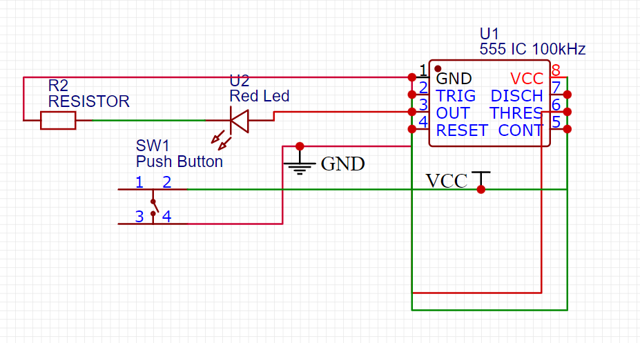
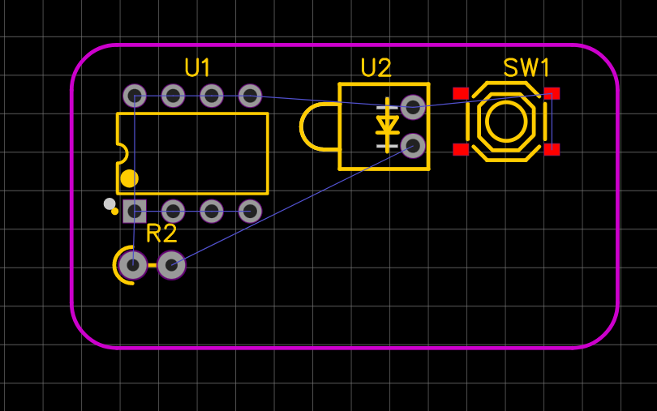
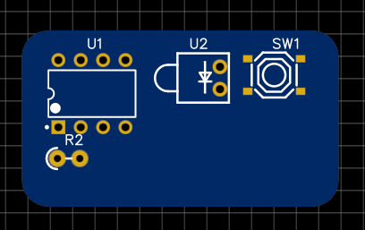
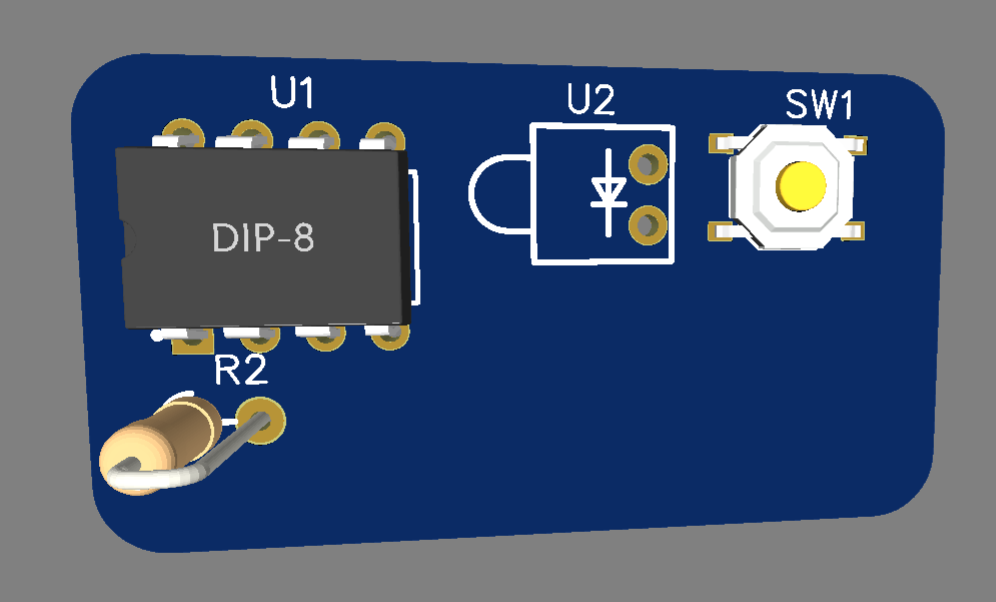

# Light Timer PCB

## Project Description
A very basic 555 timer-based PCB where pressing a button activates an LED.  
Designed to be a simple beginner soldering project with minimal components and no programming.

## Bill of Materials (BoM)
| Part              | Quantity | Description                           |
| ----------------- | -------- | ------------------------------------- |
| **NE555 Timer**   | 1        | Main timer IC (used for timing logic) |
| **Push Button**   | 1        | Tactile push buttons                  |
| **Red LED**       | 1        | LED for "ready" state                 |
| **Resistor 220Ω** | 1        | Current-limiting resistors for LEDs   |
| **Buzzer 5V**     | 1        | Active buzzer for wrong timing        |

Check out the actual [BOM file](BOM.csv)!

## Screenshots

Below are the screenshots of the schematic, PCB layout, and 3D view of the board:

### Schematic

### PCB Layout

### 2D View of the Board

### 3D View of the Board

## Slack Username
For verification, my Slack username is: `@Shahm Najeeb`

## Gerber and Drill Files
The following files are included in this repository:

- **Gerber Files:** These files are required to manufacture the PCB. They are in the `gerber/` folder.
- **Drill Files:** These files are used for drilling the holes in the PCB. They are in the `gerber/unzipped/` folder.

