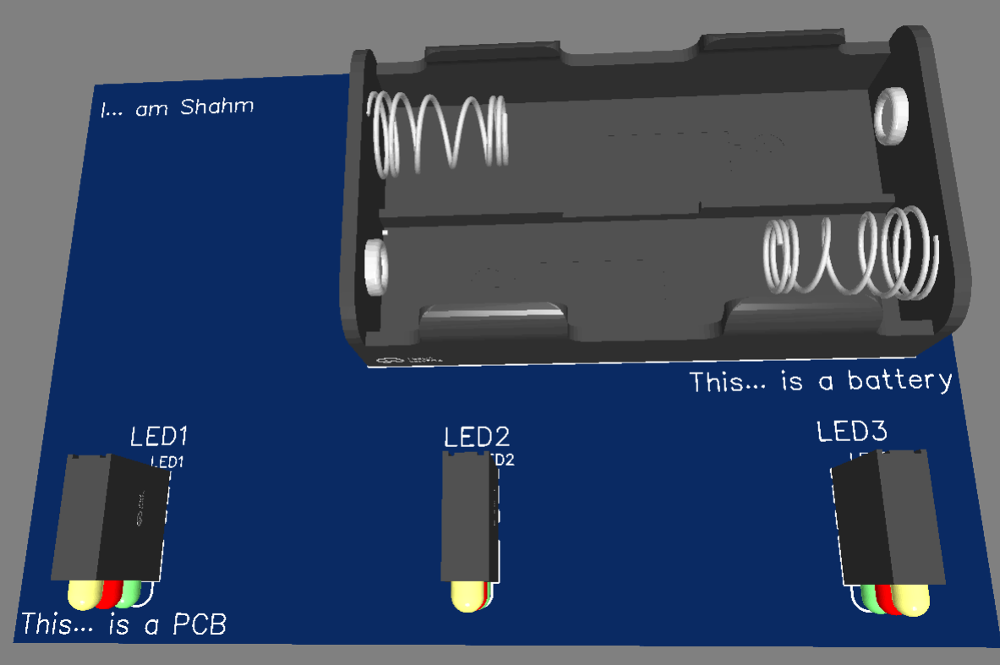

# Light Timer PCB

## Project Description
A very basic LED and battery holder.  
Designed to be a simple beginner soldering project with minimal components and no programming.

## Bill of Materials (BoM)
Check out the actual [BOM file](BOM.csv)!

## Screenshots

Below are the screenshots of the schematic, PCB layout, and 3D view of the board:

### Schematic

### PCB Layout

### 2D View of the Board

### 3D View of the Board

## Slack Username
For verification, my Slack username is: `@Shahm Najeeb`

## Gerber and Drill Files
The following files are included in this repository:

- **Gerber Files:** These files are required to manufacture the PCB. They are in the `gerber/` folder.
- **Drill Files:** These files are used for drilling the holes in the PCB. They are in the gerber zip.

